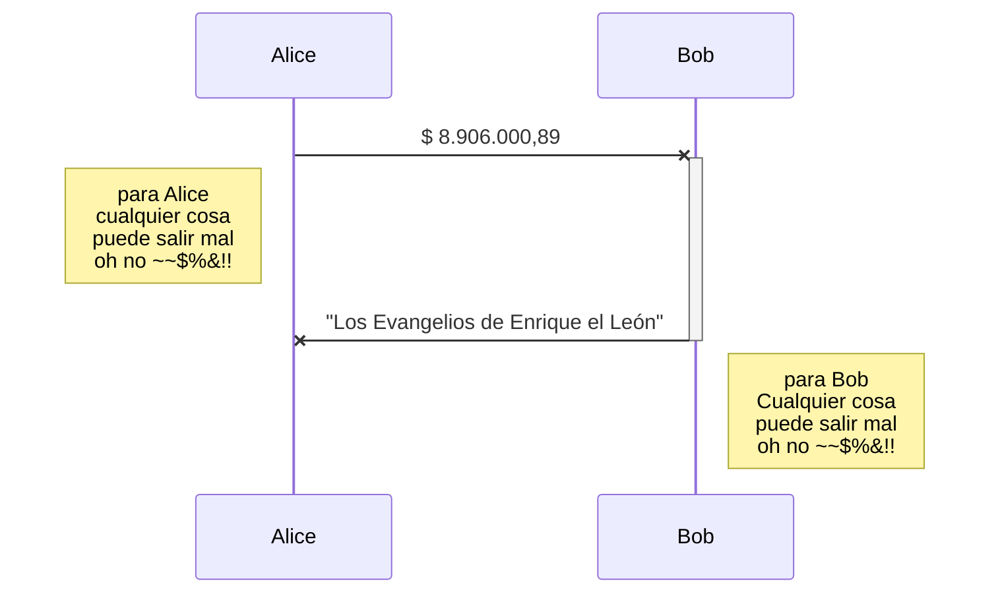
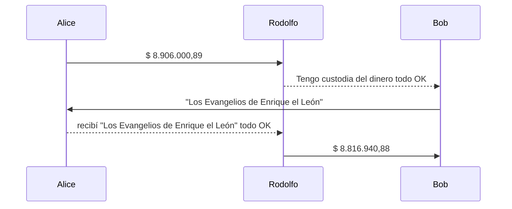

# noname
Alice quiere comprar un libro que Bob tiene en venta, Alice y Bob no se conocen, y viven en países diferentes, bajo jurisdicciones y regulaciones distintas:

buscan una agencia de asentamiento "settlement", un agente de liquidación,  que cumpla funciones de intermediario para garantizar un "cierre rápido" y "efectivo" de la operación bajo una jurisdicción relativamente segura, y ellos acuerdan operar con “Rodolfo cerrajería y agencia de asentamientos 24/7” ubicado en Suiza

