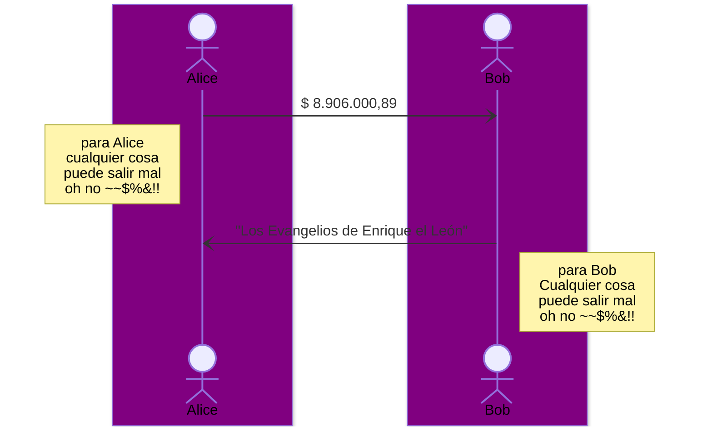
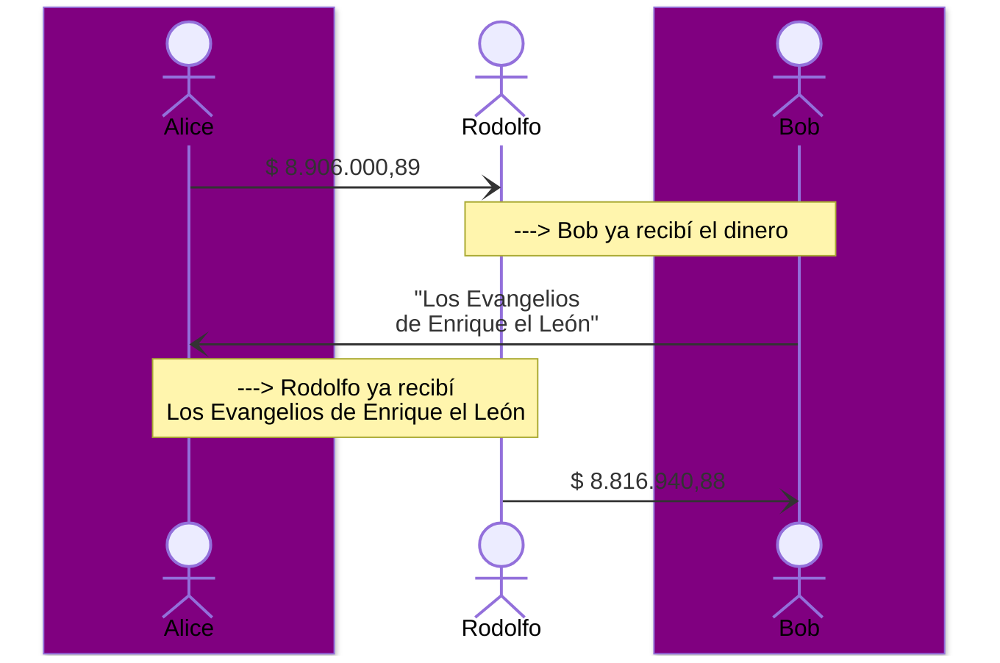

# noname
Alice quiere comprar un libro que Bob tiene en venta, Alice y Bob no se conocen, y viven en países diferentes, bajo jurisdicciones y regulaciones distintas:



buscan una agencia de asentamiento "settlement", un agente de liquidación,  que cumpla funciones de intermediario para garantizar un "cierre rápido" y "efectivo" de la operación bajo una jurisdicción relativamente segura, y ellos acuerdan operar con “Rodolfo cerrajería y agencia de asentamientos 24/7” ubicado en Suiza




Las condiciones generales establecidas para este contrato ["ESCROW"](https://www.hispacolex.com/blog/civil-mercantil/que-es-el-contrato-de-escrow/) son las siguientes: 

- Alice se compromete en enviar el monto acordado para iniciar el proceso
- Bob se compromete en completar la entrega del libro a alice en un periodo de 7 días, a partir del momento que los fondos estén bajo la custodia de Rodolfo
`Alice + Bob = via normal, sin marco temporal, pueden ejecutar el contrato cuando ellos quieran`

- Después de 7 días te inciar el contrato con el deposito de Alice a Rodolfo y si Bob no ha logrado cumplir con su parte del contrato, Rodolfo puede ejecutar el contrato con cualquiera de las dos partes, o con Alice para devolver el dinero o con Bob para completar el contrato considerando cual de las partes incumplió con el contrato. ```despues de 7 dias: o Alice + Rodolfo o Bob + Rodolfo```

