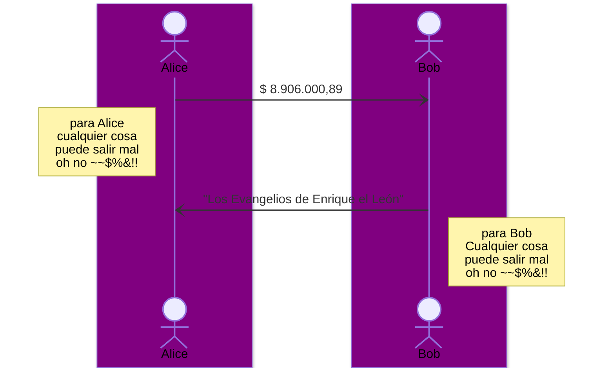
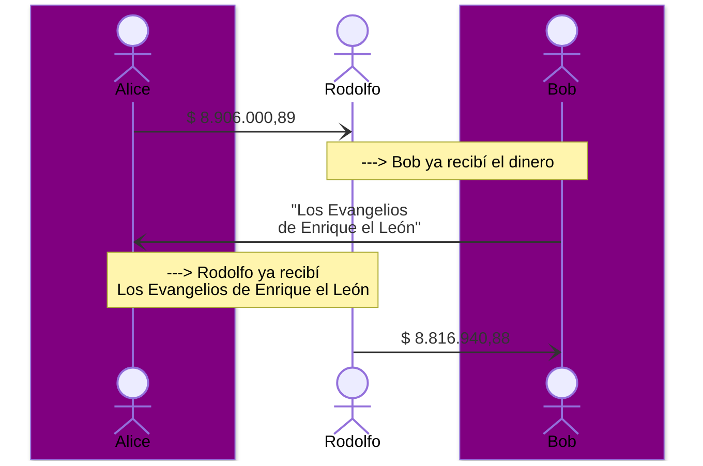
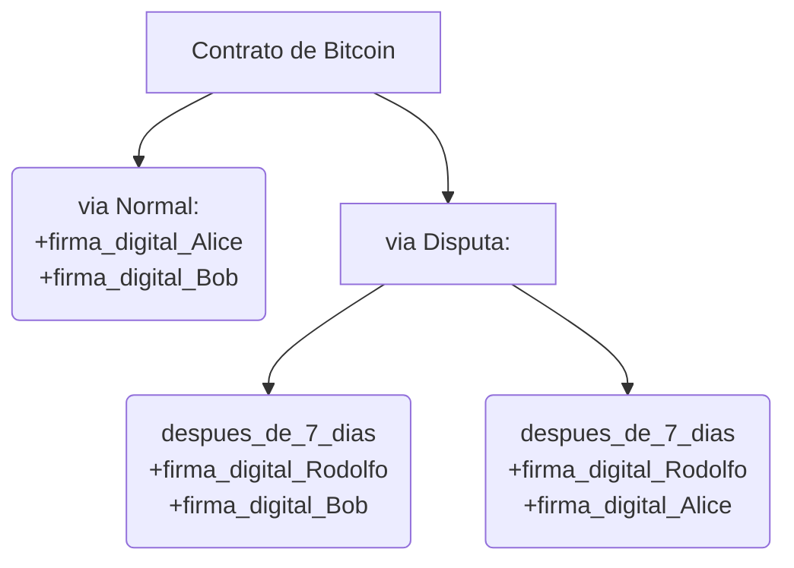

# modo Legacy
Alice quiere comprar un libro que Bob tiene en venta, Alice y Bob no se conocen, y viven en países diferentes, bajo jurisdicciones distintas:



buscan una agencia de asentamiento "settlement", un agente de liquidación,  que cumpla funciones de intermediario para garantizar un "cierre rápido" y "efectivo" de la operación bajo una jurisdicción relativamente segura, y ellos acuerdan operar con “Rodolfo cerrajería y agencia de asentamientos 24/7” ubicado en Suiza




Las condiciones generales establecidas para este contrato ["ESCROW"](https://www.hispacolex.com/blog/civil-mercantil/que-es-el-contrato-de-escrow/) son las siguientes: 

- Alice se compromete en enviar el monto acordado para iniciar el proceso
- Bob se compromete en completar la entrega del libro a alice en un periodo de 7 días, a partir del momento que los fondos estén bajo la custodia de Rodolfo
`Alice + Bob = via normal, sin marco temporal, pueden ejecutar el contrato cuando ellos quieran`

- Después de 7 días te inciar el contrato con el deposito de Alice a Rodolfo y si Bob no ha logrado cumplir con su parte del contrato, Rodolfo puede ejecutar el contrato con cualquiera de las dos partes, o con Alice para devolver el dinero o con Bob para completar el contrato considerando cual de las partes incumplió con el contrato. ```despues de 7 dias: o Alice + Rodolfo o Bob + Rodolfo```

# modo Bitcoin
Es posible realizar el mismo contrato de manera expedita con bitcoin si se incluye algun mecanismo de clasificación "rating" para con todas las partes, siguiendo el mismo modelo de los mercados [OTC](https://www.bbva.com/es/que-son-los-mercados-over-the-counter-otc/)




flujo:
1. El ofertante `Bob` genera una oferta de bien o servicio mediante la interfaz de usuario y describe las condiciones especificas de la operacion siguiendo el protocolo definido en [NIP15](https://github.com/nostr-protocol/nips/blob/master/15.md) o un clon personalizado. 
2. El comprador `Alice` propone un acuerdo de compra previamente discutido entre las dos partes, envía la información del acuerdo al mediador `Rodolfo`, para que el mismo genere el contrato digital.
3.  `Rodolfo` genera el contrato digital con la información de `Alice` y `Bob`
4.  `Alice` envía los fondos al contrato y marca su compromiso como ejecutado
5.  `Bob` crea una orden / solicitud  para usar los fondos enviados al contrato
6.  `Rodolfo` verifica que la orden generada por `Bob` sea correcta generando los pagos necesarios o compromisos a las partes involucradas, si todo está OK `Rodolfo` firma digitalmente el contrato y lo envía  a las partes.
7.  `Bob` verifica la firma digital de `Rodolfo` e inicia con el cumplimiento de su compromiso "bien o servicio", al dar por culminado su participación, marca como finalizado y notifica a las partes

en este punto el contrato puede derivar en dos ramas:

8.1. `Alice` firma el contrato digital y lo devuelve firmado a `Bob` para su firma y distribución en la red de bitcoin "vía Normal"

o

8.2. `Alice` no firma el contrato digital y después de 7 días `Rodolfo` debe dar una resolución con los contratos derivados de la "vía Disputa", sea con `Alice` para retornar los fondos o con `Bob` para dar cumplimiento con el contrato.


*Para este material educativo no se toman en cuenta todos los factores que modifican los incentivos de las partes a operar de manera saludable, así como las variables temporales y la cantidad de contratos secundarios derivados o de ejecución por via "Disputa".
*`Rodolfo` no tienen que ser 1 sola entidad, pueden ser un esquema de firmas digitales diferentes a 1 firma, por ejemplo 2-de-3 firmas o 3-de-5 firmas o partes
*el canal/medio de comunicación para intercambio de información no tiene por que ser centralizado


-el desafío más evidente es la interfaz de usuario, no es un wallet no necesita almacenar llaves de bitcoin con fondos, pero sí debe poder realizar firmas digitales compatibles con [bip340-342-350](https://github.com/bitcoin/bips/blob/master/bip-0340.mediawiki), manejar nativamente las primitivas de bitcoin, generación de llaves, serialización de transacciones etc  . . ., [bip-327](https://github.com/bitcoin/bips/blob/master/bip-0327.mediawiki), nostr [nip1-5](https://github.com/nostr-protocol/nips/blob/master/01.md) para comunicación, [nip15](https://github.com/nostr-protocol/nips/blob/master/15.md) publicación de ofertas. (Kotlin, Java ideal)  
  
